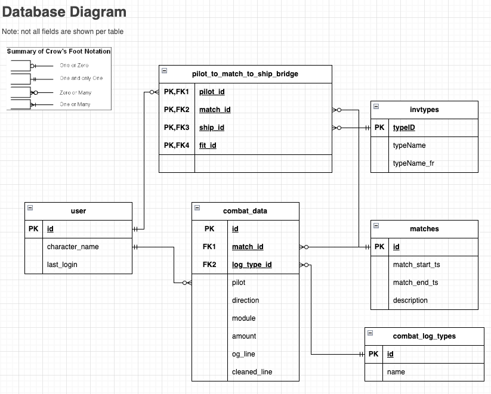

# The Analytics DB
This page details the database that is built to run the analytics

## Location
the database is built at ~/.eveanalytics and is called combat_logs.db. it can be opened with command line sql lite or sql clients like dbeaver

## Schema
below is a simple db diagram

