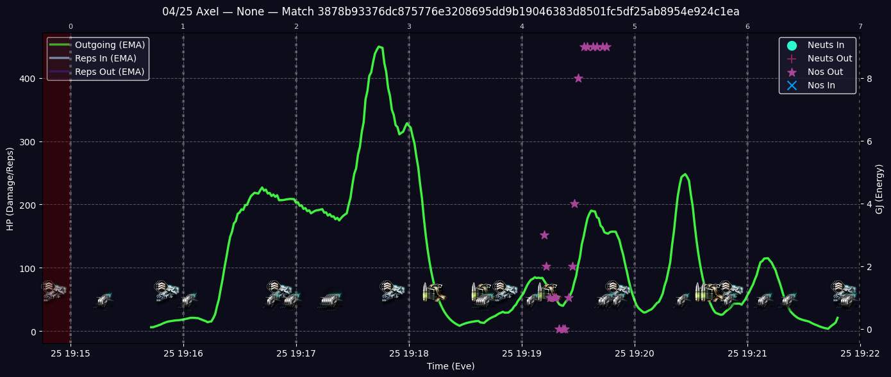
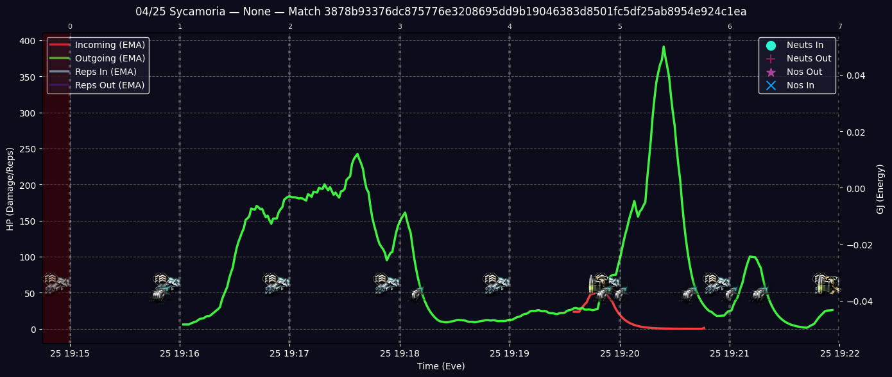

# Analytics Examples
below are some eve analytics examples. please note this tool was developed and used by during ag7 and has been refactored into a python package. more features are to come

## Fleet Diagrams
Fleet Diagrams aim to show a matches overall fight from both an incoming and outgoing perspective.

This is 2 diagrams, incoming and outgoing that will be generated.

These Diagrams Include:
- DPS (ship & drone)
- Reps
- Drone Engagements
- Reloads
- a "Pilots First Action" Dot
- Incoming/Outgoing Scrams
- Jams (wip)

**Notes**:
- The death logos that appear are always your teams. there's no way to know when an opponent died
- 

### Examples

## Pilot Diagrams
Pilot Diagrams aim to show an individual pilots fight.

One diagram per pilot per match will be generated (assuming logs included)

These Diagrams Include:
- Incoming/Outgoing DPS (ship & drone)
- Reps (incoming & outgoing)
- Drone Engagements
- Reloads
- Incoming/Outgoing Scrams
- Jams (wip)
- Energy Transfers (wip)

### Examples

